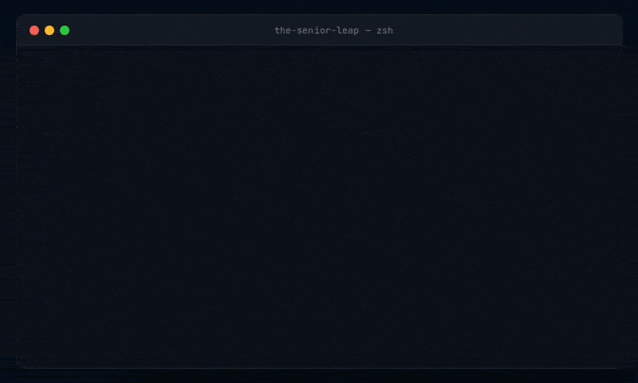

# The Senior Leap

> Hands-on exercises, rubrics, and AI-assisted evaluation for engineers closing the gap to senior.



---

Most resources teach you *what* senior engineers know.
This repo makes you practice *how* they think.

---

## The Problem

AI is writing a lot of code these days. Senior engineers increasingly spend their time directing agents, reviewing outputs, and making architectural decisions rather than writing every line themselves. The conventional wisdom is that *just coding* is becoming a commodity.

What that shift makes irreplaceable is the reasoning behind the code — the mental model that decides what to build, which tradeoffs to accept, and what will quietly fail under real conditions. That's always been what separates a senior engineer from someone who can simply produce working code. It's just more visible now.

There's a gap between mid-level and senior that's surprisingly hard to close by just writing more code. Senior engineers are distinguished by how they reason — about failure modes, system behavior under load, and the things that won't surface until three months into production.

Interview questions know this. Job listings know this. Most learning resources don't address it — they explain concepts without making you apply them under realistic pressure.

This repo does.

---

## How It Works

Every exercise follows the same structure, regardless of topic:

```
topic/exercise-name/
├── tutorial.md       ← background — read this if the concept is new to you
├── README.md         ← the scenario, your task, and how to run it
├── app/              ← a broken or incomplete app (where applicable)
├── rubric.md         ← what a senior engineer would notice (open AFTER your attempt)
├── my-analysis.md    ← write your findings here before looking at anything else
└── solution/         ← reference solution, or Reference Reasoning in rubric.md for conceptual exercises
```

**The order matters:**

1. Read `tutorial.md` if the concept is new to you
2. Read `README.md` — understand the scenario and your task
3. Attempt the exercise. Write your reasoning in `my-analysis.md` before looking at anything else
4. Open `rubric.md` — see what a senior would have caught and why it matters
5. Optionally run the AI evaluator for a deeper conversation about your reasoning

The rubric is not a pass/fail test. It's written from the perspective of a senior engineer reviewing your analysis or your PR — the things they'd flag, the questions they'd ask, the failure modes you hadn't considered.

---

## Topics

| Topic             | Exercises                                                                                  | Status        |
| ----------------- | ------------------------------------------------------------------------------------------ | ------------- |
| Node.js Internals | Event loop, V8 heap, memory leaks, streams, worker threads                                 | 🚧 In progress |
| System Design     | Queue disaster under campaign spike, Rate limit semantics shift, Cold-cache redirect storm | 🚧 In progress |
| Docker            | Multi-stage builds, layer caching, Compose networking                                      | 📋 Planned     |
| Databases         | Index strategies, N+1 problem, transaction isolation                                       | 📋 Planned     |
| Observability     | Structured logging, distributed tracing, alerting                                          | 📋 Planned     |
| Concurrency       | Race conditions, deadlocks, async hazards in Node                                          | 📋 Planned     |
| Testing Strategy  | Test pyramid in practice, contract testing                                                 | 📋 Planned     |
| Debugging         | Production incident simulations, post-mortems                                              | 📋 Planned     |
| Technical Writing | Architecture Decision Records, RFCs                                                        | 📋 Planned     |
| Security          | Auth patterns, OWASP scenarios                                                             | 📋 Planned     |

---

## Getting Started

Fork this repo. Your `my-analysis.md` files live in your fork, which over time becomes a portfolio of your reasoning across real engineering scenarios — more honest than a certificate, more useful in a job application.

```bash
git clone https://github.com/your-username/the-senior-leap
cd the-senior-leap
```

Pick a topic, start with its `README.md` for an overview, then dive into an exercise. No global setup is required — each exercise that includes a runnable app documents its own setup.

For exercises with apps, most run with:

```bash
cd topic/exercise-name/app
npm install && node index.js
```

Multi-service exercises use Docker Compose:

```bash
cd topic/exercise-name/app
docker compose up
```

---

## AI Evaluator

For open-ended exercises — especially system design — a static rubric has limits. You might reason correctly but miss an edge case, or make a defensible tradeoff you can't quite articulate.

The evaluator works entirely through files. Before running it, fill in your `my-analysis.md` — your findings, your reasoning, and anything you were uncertain about. The evaluator reads that file alongside the exercise rubric and returns structured feedback, including direct answers to whatever you flagged in your **Questions & Uncertainties** section.

```bash
cd ai-evaluator
cp config.example.yml config.yml
# Edit config.yml — set your provider and model
node evaluate.js --exercise ../system-design/queue-disaster
```

Feedback is printed to the terminal and saved as `my-evaluation.md` alongside your analysis. It covers:

- What you identified correctly
- What you missed and why it matters
- Direct answers to your stated questions
- One thing to focus on next

Supports local models through [Ollama](https://ollama.com), plus cloud options including Anthropic, OpenRouter, and Groq. **Recommended local models:** `llama3.1:8b`, `qwen2.5:7b`

The evaluator runs on an internal system prompt that keeps feedback structured and consistent across models. It's readable in [`ai-evaluator/prompts/system.md`](./ai-evaluator/prompts/system.md) if you're curious, but you don't need to touch it.

See [`ai-evaluator/README.md`](./ai-evaluator/README.md) for full setup and configuration.

---

## Your Fork as a Portfolio

When you fill in `my-analysis.md` files across exercises, your fork becomes something worth linking to. Not a certificate — evidence. A hiring manager who looks at your fork sees how you reason through a memory leak, a system design constraint, a production incident. That's the signal that gets you the senior interview.

---

## Contributing

The best exercises come from real experience. If you've debugged a gnarly production issue, made a system design call you had to defend, or hit a Docker gotcha that taught you something — it probably belongs here.

See [`CONTRIBUTING.md`](./CONTRIBUTING.md) for the exercise template and what makes a good exercise.

---

## Out of Scope

To stay focused, this repo intentionally does not cover:

- LeetCode-style algorithm challenges
- Frontend-specific topics
- Deep cloud infrastructure beyond Docker and basic orchestration

---

## License

Licensed under the MIT License. See [`LICENSE.md`](./LICENSE) for details.