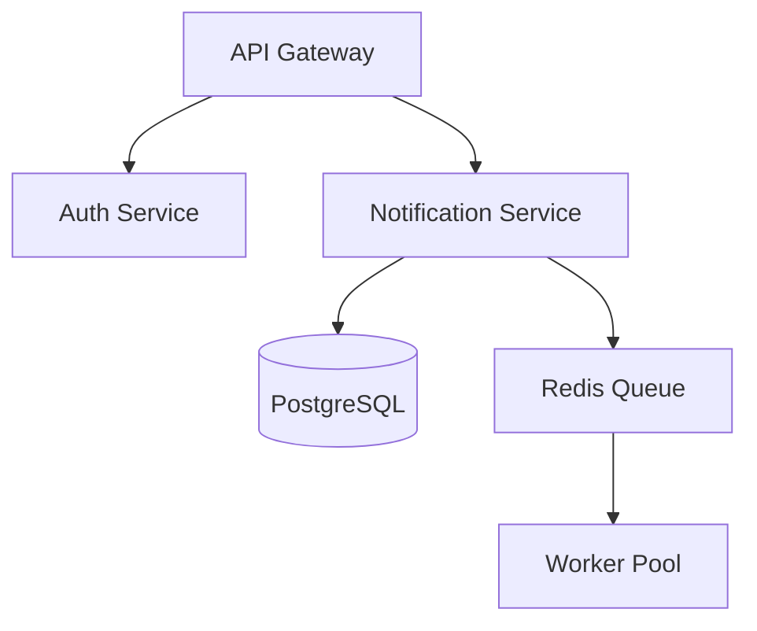

# System Design Exercises — Creation Guide

> This document governs how system design exercises are built in this repo.
> Read it in full before creating or reviewing any exercise in this topic.

---

## Philosophy

This is a teaching project. Scenarios are the vehicle, not the product.

The goal is to give engineers who haven't yet worked in complex production environments the experience of facing production-grade problems — the kind of reasoning they would be forced to develop on the job, compressed into exercises they can do alone. Many learners are between jobs, early in their careers, or at companies where this class of problem simply doesn't arise. That is who this is for.

Senior engineers are distinguished not by knowing more patterns than mid-level engineers, but by knowing which pattern matters here, what questions to ask before applying it, and what will fail under this set of conditions. Standard resources teach what the patterns are. These exercises make learners apply them under conditions that require genuine judgment.

The exercises are not designed to be cheat-proof. If a learner wants to look something up or use an AI, they can — nothing stops that. But a learner who does will shortcut exactly the reasoning the exercise is designed to build. The goal is to create conditions where working through the problem honestly produces more value than bypassing it.

The standard for a good exercise is not *"is this scenario hard to google."* It is *"does engaging honestly with this scenario build the reasoning it targets — and would a generic answer for this problem type fail against the specific conditions given?"*

---

## What Exercises Can Teach

Not all exercises teach the same kind of reasoning. The set should cover the spectrum, but most exercises should be of the first type:

**Applying a known pattern correctly under specific production conditions.** The learner may know what a thundering herd is, or what sliding window rate limiting looks like, or how to migrate a PostgreSQL column. The exercise creates conditions — load characteristics, schema constraints, live traffic requirements, failure timelines — where the generic answer breaks. The learning happens at the point where a prepared candidate discovers their standard solution doesn't fit. This is the most common and most broadly useful exercise type.

**Recognizing when the problem requires more than technical judgment.** Occasionally, the senior skill being tested is identifying that engineering cannot solve this unilaterally — that the right answer is a different kind of output entirely. Exercises in this category are valuable but narrow. Include them deliberately, not by default.

The canonical example in this repo is `erasure-request`: both assessed technical options (crypto-shredding, dual-model PII extraction) are ruled out before the learner starts — one by outside counsel, one by the structure of the event store. The exercise task is not to propose a third architecture. It is to identify what engineering brings to a cross-functional meeting, what decisions need to come out of it, and who owns each one. The senior skill being tested is recognizing that the problem has moved out of engineering's lane — and knowing what to do with that. An exercise in this category must rule out the technical path clearly enough that the learner cannot mistake it for a technical exercise with an unusual solution.

When building an exercise, decide which type it is before writing anything. Most of the rubric design, scenario framing, and task structure follows from that decision.

---

## The Litmus Test

Before finalizing any exercise, apply this test:

> **Can a candidate produce a correct answer without reasoning through the specific conditions given in this scenario?**

If yes, the exercise fails. A generic answer for this problem type should not pass.

This is not the same as asking whether the scenario involves a named pattern. Named patterns are acceptable — even expected. The question is whether the specific conditions in the scenario change what a correct answer looks like. If sliding window semantics are the subject, that's fine: the exercise should create conditions — an existing customer base with behavior expectations, a live migration requirement, a specific traffic pattern — where the implementation and the migration plan depend on reading this scenario carefully, not on recalling the general sliding window approach.

An exercise fails the litmus test if:
- The scenario can be answered correctly by describing the named pattern without engaging the specific constraints
- A rubric item can be satisfied by recalling general knowledge rather than reasoning against the evidence in the README
- A mid-level engineer who has read about this topic and a senior engineer who has shipped it would produce indistinguishable outputs

**Examples of exercises that fail this test:**
- "Design a rate limiter" — no conditions narrow which design is correct
- "Explain where Redis helps and where it hurts" — knowledge test with a narrative wrapper
- "Design a notification service" — pattern recall produces a passing answer

**Examples that pass this test despite involving named patterns:**
- A rate limiter migration where 847 existing customers have behavior expectations, the manager has publicly committed to the approach, and three live instances must maintain consistent enforcement during rollout — the named pattern is the entry point, not the answer
- A cache stampede incident where the analysis task is to evaluate whether the triggering action was even necessary for the stated schema change, and whether the proposed fix (rollback) would have made things worse
- A distributed lock problem where both investigations correctly ruled out the obvious failure modes, and the root cause lives in a relationship between P99 duration and TTL that neither investigation thought to check

---

## Exercise Patterns

Seven patterns produce exercises that meet the standard. Not all are equally strong — notes on each.

---

### Pattern 1: The Existing System Is Breaking

A system that worked under previous conditions is failing under new ones. The learner must identify what is structurally wrong and propose changes.

**Strength: High.** The forcing function is concrete — something specific is failing, not "the system could be better."

**Key requirement:** Name exactly what is breaking and under what conditions. "The system is slow" is too vague. "The notification queue grows unboundedly during batch campaigns over 500k recipients, and workers begin crashing" is specific enough to reason against. The conditions that cause the failure should create genuine diagnostic work — ideally, the obvious explanation should be something the evidence rules out.

---

### Pattern 2: The Constraint That Changed

A system was designed for constraint A. Constraint B just arrived. What breaks, in what order, and what changes?

**Strength: High.** Tests whether the learner understands why original decisions were made — not just what the current state looks like. A learner who only pattern-matched the original design cannot answer this well.

**Key requirement:** The change must create genuine architectural tension, not just a scaling dial. "Handle 10x traffic" is a dial. "The company was acquired and compliance now requires every user action to be auditable with 7-year retention" creates real tension with an existing write path.

---

### Pattern 3: The Requirements Conflict

Two legitimate requirements are architecturally incompatible. The learner proposes a resolution and defends the tradeoffs explicitly.

**Strength: High.** Forces prioritization, which is the core senior skill. The exercise fails if there is an obvious correct answer — the tension must be genuine.

**Key requirement:** Both requirements must be stated with enough specificity that the conflict is unambiguous. Avoid conflicts that dissolve into "it depends on priorities" without further constraint.

---

### Pattern 4: Pick One

The learner is given N options and must choose exactly one, then defend the choice. No hedging permitted.

**Strength: High.** Removes the "well, it depends" escape hatch. Forces commitment and explicit articulation of why.

**Key requirement:** The options must have genuine tradeoffs against each other for the specific scenario given. Generic options without scenario context ("choose between PostgreSQL and MongoDB") collapse into knowledge tests. The scenario must make certain options obviously wrong for specific reasons.

---

### Pattern 5: The Migration

A system must move from state A to state B under a hard constraint: zero downtime, data integrity, a specific timeline, or some combination. The learner designs the migration plan.

**Strength: High.** Migration is one of the highest-value senior skills and is almost never covered in standard resources. The rubric can surface dual-write hazards, backfill sequencing, consistency verification, rollback triggers — observations that only come from having shipped migrations.

**Key requirement:** The constraint must be real and specific. "Zero downtime" is only meaningful if the exercise specifies current traffic volume and write rate. The most instructive scenarios are those where a naive migration produces a subtly wrong outcome — not a crash, but a violation that might not be noticed immediately.

---

### Pattern 6: Resource-Constrained Design

The learner designs a system under realistic resource constraints: two engineers, 90 days, a $200/month budget. Simplicity becomes the correct architectural choice.

**Strength: Medium.** Valuable but requires more care in rubric design. "A senior wins by choosing simplicity" is correct but hard to make specific enough for a rubric item. Works best when combined with a specific failure mode that over-engineering would cause or a specific over-engineered choice a mid-level would naturally reach for.

**Key requirement:** Constraints must create genuine dilemmas, not just filter out expensive options. The rubric must name specific over-engineering moves and explain why they are wrong here, not just expensive.

---

### Pattern 7: The Production Incident Post-Mortem

A specific incident happened. Here is what the monitoring showed. Here is the architecture. What went wrong, what design weakness allowed it, and what changes prevent recurrence?

**Strength: High.** Combines diagnosis and design. Forces reasoning about failure modes rather than ideal-state patterns. Closest in structure to node-internals exercises — the learner reasons against evidence, not a blank specification.

**Key requirement:** The incident must be specific and the evidence must be sufficient to diagnose the root cause without guessing. This pattern benefits most from embedded artifacts — timelines, metrics tables, architecture diagrams. At least one data point in the evidence should require careful reading to notice — a single timeline entry, an anomaly in the metrics table, a detail in the architecture diagram. If every data point is immediately legible, the diagnostic work is too easy.

---

## File Structure

```
system-design/exercise-name/
├── README.md       ← scenario, all embedded artifacts, task
├── tutorial.md     ← optional targeted background
├── rubric.md       ← senior observations + reference reasoning
└── my-analysis.md  ← learner output (unchanged from repo template)
```

**No `app/` directory.** System design exercises have no runnable application.

**No `solution/` directory.** The rubric replaces it. The final section of `rubric.md` is a Reference Reasoning block that serves as the reference solution — not a prescriptive answer, but the reasoning a senior engineer would apply.

**All artifacts are embedded in `README.md` as markdown.** No additional files are added to the exercise directory. If the README becomes unwieldy, the scenario is too complex — simplify it, do not split the file.

**Folder naming:** lowercase, hyphenated, describes the specific scenario. `queue-disaster` ✓ — `notification-exercise` ✗

---

## Artifact Handling

Every artifact the learner needs lives in `README.md`. Place each artifact in the scenario section at the point where it is contextually relevant — do not dump all artifacts at the end.

### Architecture diagrams → Mermaid blocks

````markdown

````

### Timelines → labeled ordered lists

```markdown
- **03:14 UTC** — deploy completes; queue depth: 12,000 messages
- **03:17 UTC** — queue depth: 180,000; worker CPU at 98%
- **03:22 UTC** — first worker OOM crash; duplicate notifications begin
- **03:31 UTC** — on-call manually scales workers; queue stabilizes
- **03:44 UTC** — 14,000 duplicate emails confirmed across 8,200 users
```

### Metrics and data → markdown tables

```markdown
| Time (UTC) | Queue Depth | Active Workers | Error Rate | p99 Latency |
| ---------- | ----------- | -------------- | ---------- | ----------- |
| 03:00      | 12,000      | 4              | 0.1%       | 180ms       |
| 03:15      | 45,000      | 4              | 0.8%       | 420ms       |
| 03:20      | 180,000     | 4              | 14.2%      | 8,400ms     |
| 03:31      | 180,000     | 16             | 9.1%       | 3,200ms     |
```

### Requirements documents → markdown sections

Use headers and bullet lists. Write them to feel like actual product or compliance briefs, not exercise descriptions. The learner should feel they are reading a real document.

### Incident report structure

When the exercise is a post-mortem (Pattern 7), the scenario section follows this order:

1. **Summary** — one paragraph, what happened and what the impact was
2. **Timeline** — labeled ordered list
3. **Current architecture** — Mermaid diagram
4. **Evidence** — metrics table and/or representative log lines (as code blocks, not prose)

---

## File-by-File Guide

### README.md

The learner's entry point. Should feel like being handed a real problem, not enrolled in a course.

**Scenario section**

Write in present tense, from inside the situation. The reader has just been handed this. Use specific names, specific numbers, specific symptoms.

> ✅ Good:
> The notification service has been in production for eight months. It handles 50,000 messages per day without incident. Marketing confirmed a campaign targeting 4 million users launching in 72 hours. There is no load test documentation above 200k. Nobody knows what happens at 4 million.

> ❌ Not this:
> In this exercise, you will explore scaling challenges in notification systems.

**Task section**

Be explicit about what a good output looks like. Name the format the learner should produce. Always include asking for the questions the learner would ask before proposing anything — this is the senior dimension that most exercises miss.

Example task structure:
```
Write your analysis in `my-analysis.md`. Cover:

1. What you would need to know before proposing any changes — the questions you would ask first
2. What the current architecture's failure modes are under the new load
3. What changes you would propose, in priority order, with rationale
4. What risks remain after your changes, and why they are acceptable
```

**Tutorial hint**

When the exercise involves a named pattern the learner should be familiar with, the tutorial hint in `README.md` files of exercises can point to it without spoiling the diagnostic task. The right framing: point to the concept, not to the diagnosis.

> ✅ "If sliding window rate limiting is new to you, read `tutorial.md` first."

> ❌ "If idempotency in distributed messaging is new to you, read `tutorial.md` first." — this signals the root cause category before the learner has started.

When a scenario has a specific root cause the learner must discover, do not let the tutorial hint name that category. If the tutorial covers more than one relevant concept, point to the tutorial generally without naming the specific concept that unlocks the diagnosis.

**How to Run section**

Delete this section entirely. There is no runnable app.

**AI evaluator command**

Update the path but keep the section. Learners should still know they can use the evaluator.

---

### tutorial.md

Only include it if the exercise requires knowledge that cannot reasonably be assumed. Keep it targeted to exactly what the exercise needs — not a comprehensive guide.

Test: can someone who already knows this concept skip the file and still complete the exercise? If yes, the length is right.

System design exercises are more likely than node-internals exercises to need a tutorial, because the relevant concepts (event sourcing, dual-write patterns, circuit breakers, saga patterns) have fewer canonical resources than Node.js internals and are less likely to be common knowledge. When in doubt, include a lean tutorial rather than assuming familiarity.

**What a tutorial should not do:** explain the correct answer or signal the root cause. A tutorial covering distributed locking should explain the atomic `SET NX EX` pattern and why the two-step SETNX form is broken — not explain what happens when a lock's TTL is shorter than the job it protects. The former is background. The latter is the exercise.

---

### rubric.md

The most important file. The quality of the rubric determines the quality of the exercise.

**The core standard: every item must be a specific observation, not a topic category.**

> ❌ Bad: "A senior thinks about caching."
> ❌ Bad: "A senior considers idempotency."
> ❌ Bad: "A senior would notice the retry behavior."

> ✅ Good: "The worker's retry logic has no idempotency key. If a worker crashes mid-batch, it restarts processing from the last checkpoint — but checkpoint is defined as the start of the current batch, not the last successfully sent message. Any crash produces duplicates for the entire in-flight batch, not just the failed message. At 4M sends this means tens of thousands of duplicate notifications from a single worker restart."

> ✅ Good: "Before estimating queue throughput, a senior asks whether the downstream email provider has a send rate limit. At 4M messages with a 100 sends/second API cap, the minimum delivery window is 11 hours regardless of internal queue performance. No architectural change fixes this. Missing this question means every throughput estimate in the analysis is meaningless."

**The real-world consequence rule**

Every rubric item must explain what breaks, degrades, or fails when this is missed — not just that it is wrong, but the operational consequence at realistic scale or under realistic failure conditions.

**The "questions first" dimension**

At least one rubric item per exercise should surface a question the learner should have asked before proposing any design. This is the senior dimension that standard system design resources never test. A senior who jumps to a solution without naming the dominant constraint is doing mid-level work even if the solution is correct.

**The "conditions that break the generic answer" dimension**

For exercises involving named patterns, at least one rubric item should name the specific condition in the scenario that a generic answer gets wrong. This is where the teaching happens — not in confirming that the learner knew the pattern, but in confirming they found where this scenario's conditions diverged from the textbook case.

**Rubric structure**

```
### 🔴 Critical
2–3 items. Things a senior flags immediately. Missing these in a review or interview
signals a fundamental gap — not an oversight, but a missing mental model.

### 🟡 Important
1–2 items. Things that separate a solid mid-level from a senior. Often operational
concerns or failure modes that only surface under specific conditions.

### 🟢 Bonus
1 item maximum. A proactive observation a senior might raise unprompted — an edge
case, a forward-looking concern, a question nobody asked. Missing this does not
reveal a gap. Noticing it signals senior-level thinking.

### Common Mistakes
What most learners get wrong or skip. Explains not just what the right answer is
but why the instinct led somewhere else.
```

**The Reference Reasoning block**

The final section of every `rubric.md`. This replaces the `solution/` directory.

```markdown
## Reference Reasoning

> This is not the correct answer. It is the reasoning a senior engineer would apply
> and the design they would likely land on. A defensible answer that reaches different
> conclusions through sound reasoning is equally valid.

**Questions a senior asks before designing anything:**
- [Specific question that dominates the constraint space]
- [Specific question that reveals a hidden dependency or limit]

**What they would likely propose:**
[The design, with rationale — not a list of technologies, but why each choice follows
from the constraints given]

**What they would explicitly not do, and why:**
[The over-engineered or wrong-direction choices, and the specific reason they are wrong
for this scenario — not wrong in general]

**What risks remain:**
[What the proposed design does not solve, and why those risks are acceptable given
the constraints]
```

---

### my-analysis.md

Use the repo template exactly as-is. No modifications for system design exercises.

The template's **Questions & Uncertainties** section is especially important for system design — it is where learners flag "I wasn't sure whether X or Y" moments that reveal whether they are reasoning or pattern-matching. The AI evaluator reads this section and addresses each point directly.

---

## Rubric Item Checklist

Run every rubric item through these checks before the exercise is finalized:

- [ ] Is this a specific observation or a topic category? If it contains only a noun — "caching," "idempotency," "sharding" — it is a category. Rewrite it.
- [ ] Does it name the operational consequence of missing it?
- [ ] Would a mid-level engineer who completed the exercise honestly miss this?
- [ ] Is it diagnosable from the scenario and artifacts given, without information not provided?
- [ ] Does at least one item per exercise surface a question the learner should have asked before designing?
- [ ] For exercises involving named patterns: does at least one item name the specific condition that breaks a generic answer?

---

## Full Exercise Checklist

Before an exercise is considered complete:

- [ ] Does it pass the litmus test? Can a candidate produce a correct answer without reasoning through the specific conditions given? If yes, it is not ready.
- [ ] Does the scenario name something specific that is failing, changing, or in conflict — not just a system to design?
- [ ] Does the tutorial hint, if present, point to the concept without signaling the root cause or diagnosis?
- [ ] Does the task section explicitly ask for the questions the learner would ask before proposing anything?
- [ ] Does every rubric item pass the rubric item checklist above?
- [ ] Are embedded artifacts sufficient to diagnose the problem without guessing? No artifact should require information not present in the README.
- [ ] Is the tutorial lean enough that someone who knows the concept can skip it without missing anything needed for the exercise?
- [ ] Does the Reference Reasoning block include what not to do and why?
- [ ] Is the scenario written in present tense from inside the situation?
- [ ] Does the scenario use specific numbers, specific symptoms, and specific conditions — not vague descriptions?