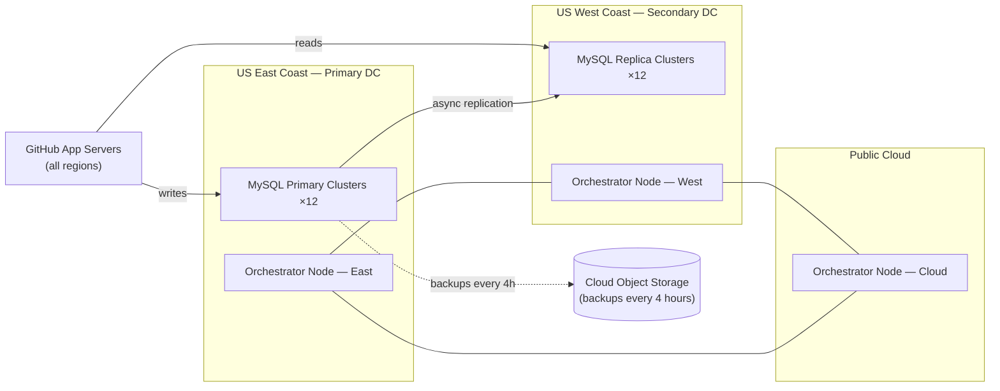

# Cross-Region Failover

> 24 hours and 11 minutes. That's how long it took to undo 43 seconds of downtime. The status page just turned green. You're an engineer at GitHub. The post-mortem review starts in 90 minutes, and you want your analysis written before you walk into that room.

---

## Scenario

GitHub runs MySQL in a primary-replica topology distributed across two data centers: US East Coast and US West Coast. Every piece of platform metadata — issues, pull requests, comments, notifications, commit history — lives across twelve MySQL clusters. At steady state, write traffic routes to East Coast primaries; reads are spread across replicas in both regions.

To handle primary failures, GitHub uses Orchestrator, an internal tool for managing MySQL cluster topologies and automated failover. Orchestrator uses Raft consensus to elect a leader and make promotion decisions. Three Orchestrator nodes run in distinct locations: the East Coast data center, the West Coast data center, and a public cloud site. This three-node quorum allows Orchestrator to make decisions whenever any single site is unreachable.

Replication between East Coast primaries and West Coast replicas runs asynchronously. Writes are confirmed to the application as soon as the primary commits — replicas receive and apply them in the background.



On the evening of October 21, a network engineer replaced a 100GB optical cable on the East Coast backbone during a planned maintenance window. The swap was expected to cause less than a second of interruption. During the replacement, the East Coast data center lost all external connectivity for 43 seconds.

In those 43 seconds, three things happened simultaneously:

1. The East Coast primary clusters continued accepting writes from application servers already connected to them.
2. Those writes were never replicated to West Coast replicas — the replication channel was severed.
3. The West Coast and public cloud Orchestrator nodes, unable to reach East Coast, established Raft quorum and began promoting West Coast replicas to primary across all twelve clusters.

When the 43 seconds ended and connectivity was restored, GitHub had twelve MySQL clusters in an unexpected state: West Coast replicas were now primary, and the East Coast — which had just accepted real production writes — had been demoted to replica. The writes accepted by the East Coast primaries during the partition had never reached the new primaries. The clusters had diverged.

**Timeline:**

- **22:52:00 UTC** — Planned maintenance begins; optical cable replacement starts on East Coast backbone
- **22:52:00–22:52:43 UTC** — East Coast data center loses all external connectivity; 43-second partition begins
- **22:52:35 UTC** — Orchestrator's West Coast and public cloud nodes establish Raft quorum; promotion begins across all twelve clusters
- **22:52:43 UTC** — Connectivity restored; East Coast and West Coast clusters have diverged; East Coast holds writes the new West Coast primaries never received
- **22:53:00 UTC** — Application write traffic now routes to West Coast primaries; East Coast app servers begin writing cross-country at 85ms round-trip
- **23:02:00 UTC** — On-call engineers confirm database topology is in an unexpected state; Orchestrator API shows West Coast as primary across all clusters; write error rate climbing
- **23:09:00 UTC** — Deployment tooling locked to prevent further changes; site moved to yellow status
- **23:13:00 UTC** — Status red; multiple application services unable to tolerate cross-region write latency; incident coordinator called
- **23:20:00 UTC** — Decision reached: rebuild East Coast from West Coast state; the partition-window writes on East Coast cannot be recovered cleanly; affected users will be identified and contacted
- **23:45:00 UTC** — Cloud backup restoration begins for all twelve clusters; each cluster's backup requires hours to load from object storage
- **+6h (05:30 UTC)** — First four clusters restored and streaming as East Coast replicas; partial service recovery begins
- **+24h11m (23:03 UTC, Oct 22)** — Final cluster restored; write traffic returns to East Coast primaries; site returns to green
- **Post-incident** — 5.3 million webhook events processed from queue; 80,000 GitHub Pages builds requeued and rebuilt

**Metrics:**

| Time (UTC) | Site Status | Write Target               | Replication State  | Write Error Rate | App → DB Write Latency  |
| ---------- | ----------- | -------------------------- | ------------------ | ---------------- | ----------------------- |
| 22:51:00   | 🟢 Green     | East Coast                 | Healthy, lag <1s   | 0.1%             | 3ms (same-region)       |
| 22:52:44   | 🟢 Green     | West Coast (failover)      | **Diverged**       | 2.4%             | 85ms (cross-country)    |
| 23:02:00   | 🟢 Green     | West Coast                 | **Diverged**       | 8.1%             | 85ms                    |
| 23:09:00   | 🟡 Yellow    | West Coast (locked)        | **Diverged**       | 8.1%             | 85ms                    |
| 23:13:00   | 🔴 Red       | Reads only (degraded)      | **Diverged**       | 41.3%            | N/A (writes suspended)  |
| +6h        | 🟡 Yellow    | West Coast + 4 E. clusters | Partially resynced | 12.0%            | 3ms (restored clusters) |
| +24h11m    | 🟢 Green     | East Coast (restored)      | Healthy, lag <1s   | 0.2%             | 3ms                     |

---

## Your Task

Write your analysis in `my-analysis.md`. Cover:

1. **Before proposing anything, write down the questions you would bring to the post-mortem.** What does the evidence not yet answer? What assumptions about the system do you need to verify before you can recommend anything? What would change your diagnosis if the answer was different?

2. **Diagnose the root cause.** The partition lasted 43 seconds. Trace the specific mechanism that turned it into a 24-hour incident. "The failover triggered" is a description, not a diagnosis. What two properties of the system, taken together, produced a state the team had no fast path out of? Use the metrics table — the write latency column and the error rate column tell different parts of the story.

3. **Explain the recovery constraint.** The partition lasted 43 seconds. The recovery required rebuilding twelve MySQL clusters from cloud backups and took 24 hours and 11 minutes. "Backup restoration is slow" is a consequence, not a cause. What is the root cause of why cold backup rebuild was the only available path? What would need to have been true about the system for a faster recovery path to exist?

4. **Evaluate the mitigations and pick exactly one to ship first.** Three options are on the table:

   - **Option A — Constrain Orchestrator's promotion scope:** Reconfigure Orchestrator to restrict automated promotions to within the same region. Same-region failover remains automated and fast; cross-region failover requires explicit human approval.
   - **Option B — Move to semi-synchronous replication:** Require the primary to wait for at least one replica to acknowledge each write before confirming it to the application. Changes the replication guarantee from "fire-and-forget" to "at-least-one-replica-durable."
   - **Option C — Add a human gate to all automated failover decisions:** Orchestrator identifies the correct promotion candidate but does not apply it without on-call engineer approval. Removes automation from every failover decision.

   Pick exactly one to ship first. Name what your choice prevents, what it explicitly does not prevent, and why you prioritized it over the other two. If you would ship two of them together, say why — but name the cost.

5. **After your chosen mitigation is deployed, what risks remain?** Name them specifically: which failure modes survive your change, under what conditions, and why they are acceptable given the constraints.

Write your full reasoning in `my-analysis.md` before opening `rubric.md`.

---

## Prerequisites

If MySQL replication modes or consensus-based automated failover tools are new to you, read `tutorial.md` first. Otherwise, jump straight in.

---

## How to Self-Evaluate

Once you have written your analysis, open `rubric.md` and compare it against what you found.

To get AI-assisted feedback on your reasoning — especially useful for the uncertainties you flagged:

```bash
cd ../../ai-evaluator
node evaluate.js --exercise ../system-design/cross-region-failover
```
