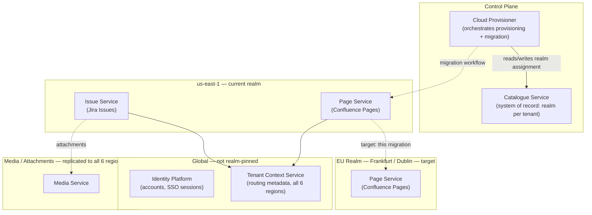

# Data Residency Retrofit

> Server support ends in six weeks. The contract is already signed — Sales promised data residency as a term of the deal. You're a senior engineer on Atlassian's Cloud Platform team, and nobody checked with engineering before the signature went on the page.

---

## Scenario

Atlassian Cloud runs on AWS. When Jira and Confluence first moved off Atlassian's own data centers, the footprint was simple: `us-east-1` and `us-west-2`, nothing more. A few months later, a ShipIt hackathon team proved out deploying to a new region — `eu-west-1` in Ireland — and the results were good enough that the company kept going. Today the platform spans six regions: `eu-west-1`, `eu-central-1`, `ap-southeast-1`, `ap-southeast-2`, `us-west-2`, and `us-east-1`.

As the monolith broke apart into services, each service made its own call about how to handle multi-region data. Two patterns emerged, informally:

- Services that weren't latency-sensitive stayed single-region.
- Services with tight latency requirements replicated to all six regions.

Nobody coordinated this. It didn't need to be coordinated — the only goal was speed, and both patterns were reasonable ways to get it.

That stopped being true the day data residency became a sales requirement. A financial-services enterprise customer in Germany has signed a Cloud contract, and the contract includes a data residency clause: this tenant's Jira and Confluence content must live only in the EU realm — Frankfurt and Dublin, nothing else — as a condition of the deal. Legal's compliance framing leans on real regulatory obligations, GDPR among them, and industry-specific expectations financial-services customers hold Atlassian to. The customer's current Server instance has kept them compliant for years the simple way — the data never left their own building. Server support ends February 15, 2024. The signed contract gives engineering six weeks to make Cloud actually true to what Sales already promised.

You're the engineer assigned to make it true.

### Internal Reference — Multi-Region & Data Residency Principles

*(pulled from the platform wiki, written before this contract was signed)*

- For a given tenant, there is a **realm**: the geographic boundary that constrains which regions its data may live in. The realm is recorded canonically in a centralized system, not inferred per-service.
- Services that hold user-generated content are organized into **shards** — a shard defines which regions a service's data lives in for a given tenant, plus the metadata needed to route requests to it.
- Data residency, as a product commitment, targets **primary UGC at rest** — think Jira Issues, Confluence Pages. It does not automatically extend to every system that happens to touch a tenant's data.
- Not every service can be onboarded to every realm at the same time. New regional capability rolls out service-by-service.
- Operations that move where data lives — provisioning a new tenant, migrating an existing one between realms — run through a centralized control plane built on a workflow orchestration engine. Normal reads and writes run through a separate data plane.



### Service Readiness — This Tenant, Today

| Service                | Holds                                   | Current region(s) for this tenant                                                     | EU realm status                                  |
| ---------------------- | --------------------------------------- | ------------------------------------------------------------------------------------- | ------------------------------------------------ |
| Issue Service          | Jira Issues (primary UGC)               | `us-east-1` only                                                                      | Not yet deployed to EU realm                     |
| Page Service           | Confluence Pages (primary UGC)          | `us-east-1` only                                                                      | Live in EU realm — supports migration today      |
| Media Service          | Attachments, images, files              | Replicated across all 6 regions                                                       | Live in EU realm, but also replicates outside it |
| Tenant Context Service | Routing/metadata (not customer content) | Replicated across all 6 regions                                                       | Infrastructure only — not customer UGC           |
| Identity Platform      | Account records, SSO sessions           | Global, centralized                                                                   | Not realm-pinned, by design                      |
| Activity Service       | Cross-product activity feed             | Configurable per tenant: single-region shard, or a global shard replicated everywhere | Depends on which shard this tenant is assigned   |

---

## Your Task

Write your analysis in `my-analysis.md`. Cover:

1. **Before proposing anything, write down the questions you would ask first.** What does "data residency" actually cover, contractually and technically? What would you need Legal to clarify before you can tell them whether six weeks is realistic? Look closely at the Service Readiness table — what does it rule out immediately?

2. **Diagnose why the current architecture wasn't built for this.** The single-region-vs-replicate-everywhere split across services was a reasonable engineering decision when the only goal was latency. Explain specifically why that same split becomes a liability the moment the goal changes to "must never leave this boundary" — and why no single service's design is "wrong," even though the system as a whole can't yet deliver what was promised.

3. **Design the migration path for the pieces that can move today**, given the table above. What is the correct order of operations for moving a tenant's data between realms under live traffic — and what specifically goes wrong if that order is reversed? What do you do about a request or event that's already in flight — submitted before the migration, arriving after it?

4. **Define what "residency achieved" actually means for this tenant**, and say so precisely enough that Legal could sign off on it. Which parts of the architecture fall outside the realm boundary by design, not by oversight? Given the Issue Service gap, what do you tell Legal about the six-week deadline — and what would you propose doing in the meantime?

5. **After your migration plan ships, what risks remain?** Name them specifically — which failure modes survive, under what conditions, and why they're acceptable given the constraints.

Write your full reasoning in `my-analysis.md` before opening `rubric.md`.

---

## Prerequisites

If data residency, realms/shards, or the control-plane/data-plane split in multi-region systems are new concepts to you, read `tutorial.md` first. Otherwise, jump straight in.

---

## How to Self-Evaluate

Once you have written your analysis, open `rubric.md` and compare it against what you found.

To get AI-assisted feedback on your reasoning — especially useful for the uncertainties you flagged:

```bash
cd ../../ai-evaluator
node evaluate.js --exercise ../system-design/data-residency-retrofit
```
