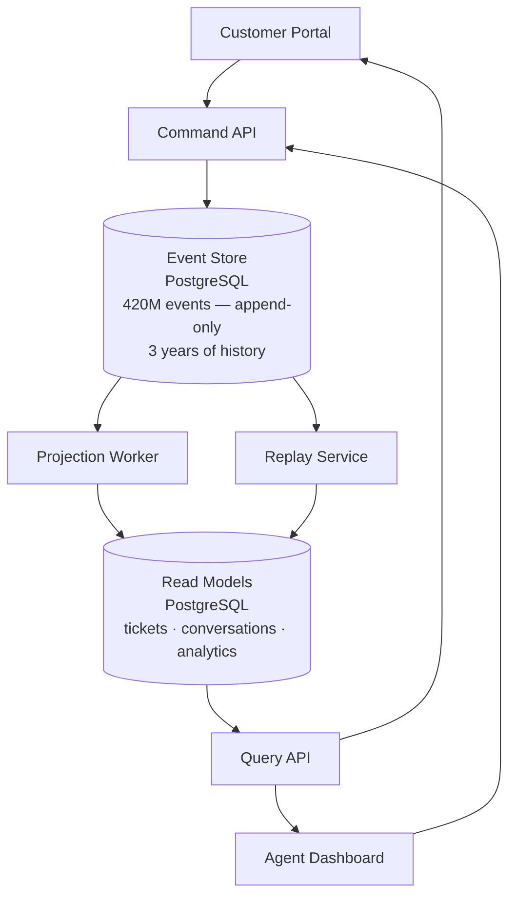

# Erasure Request

> Legal just forwarded you a thread that started 20 days ago. Subject line: "GDPR Art. 17 — Müller erasure request — Day 20 of 30." The last message is from the General Counsel: "Engineering needs to be in the room tomorrow morning. We are out of options and the clock is running."

---

## Scenario

SupportOps is a B2B SaaS customer support platform that has been in production for three years. The platform is built on event sourcing: every action — ticket created, message sent, agent assigned, status changed — is written as an immutable event to an append-only PostgreSQL event store. Read models are projections built from those events. There is no other source of truth.

The event store holds approximately 420 million events across three years of production. Events range from structured (`TicketStatusChanged`, `AgentAssigned`) to free-text (`MessageAdded`, `NoteAdded`). The free-text events contain the full content of customer messages and internal agent notes — unmodified, exactly as submitted. These messages routinely contain names, email addresses, phone numbers, addresses, and account numbers that constitute personal data under GDPR.



The platform serves 34 enterprise customers. Twelve of those customers are contracted under an enterprise SLA that includes the following clause:

---

### Enterprise SLA — Section 4.3

> **Data Integrity and Replay Guarantee**
>
> Provider guarantees the integrity of all event data for the duration of the contract term and for a minimum of one year following contract termination. Provider further guarantees that any event state may be reconstructed via point-in-time replay to within a 60-second window of any moment within the retention period. This guarantee applies to all event types without exception.

*No carve-out or exception clause exists in Section 4.3 or elsewhere in the current contract template.*

---

Twenty days ago, a subject access and erasure request arrived from an EU-based end user whose employer is one of the twelve enterprise SLA customers. The request invokes GDPR Article 17. Legal has been working the problem since Day 1.

**Timeline:**

- **Day 1** — Erasure request received from Klaus Müller, an employee of Hartmann GmbH (enterprise SLA customer). Legal opens ticket, notifies engineering.
- **Day 3** — Legal forwards to engineering: "30-day statutory clock is running. We need technical options assessed by Day 7."
- **Day 7** — Engineering assessment complete. Two candidate approaches identified: crypto-shredding (primary) and a dual-model PII lookup table (fallback).
- **Day 9** — Legal engages outside counsel to assess whether crypto-shredding satisfies erasure under current ICO guidance.
- **Day 14** — Outside counsel declines to issue a written opinion. ICO guidance on crypto-shredding is ambiguous and no formal determination exists. Counsel will not expose the company to regulatory risk on an unsettled interpretation. **Crypto-shredding is ruled out as a compliance mechanism for this request.**
- **Day 16** — Engineering proposes retrofitting the historical event store to the dual-model pattern: PII extracted to a separately erasable relational store, only pseudonymous identifiers retained in the event stream.
- **Day 17** — Assessment of the historical event store begins. Finding: the large majority of events containing personal data are `MessageAdded` and `NoteAdded` events with PII embedded in unstructured free-text. There are no consistent field boundaries. Systematic extraction is not feasible without destroying the semantic content of each event — which would invalidate any projection that depends on message content. The dual-model approach cannot be retrofitted to the existing event store on any timeline that matters for this request. **The fallback approach is ruled out for the immediate erasure.**
- **Day 20 (today)** — General Counsel calls the meeting. Both assessed options are exhausted. Ten days remain on the statutory clock.

---

## Your Task

Write your analysis in `my-analysis.md`. Cover:

1. **Before proposing anything, write down the questions you would bring to tomorrow's meeting.** What does engineering need to know that only Legal or the business can answer? What decision has not yet been made — and what are the downstream architectural consequences of each possible answer?

2. **Name the conflict precisely.** What are the two obligations in tension? What does each one require? Why is this conflict not resolvable through technical means alone, even given unlimited engineering time?

3. **Evaluate what engineering can actually do in the next 10 days.** Both primary options are off the table for the immediate request. What — if anything — can engineering do right now that is useful without committing to a design that may turn out to be wrong?

4. **What does the correct output from tomorrow's meeting look like?** If engineering's job is not to present an architecture, what is it? What decisions need to come out of that meeting, and who owns each one?

5. Write your full reasoning in `my-analysis.md` before opening `rubric.md`.

---

## Prerequisites

If event sourcing or GDPR Article 17 are unfamiliar, read `tutorial.md` first. Otherwise, jump straight in.

---

## How to Self-Evaluate

Once you have written your analysis, open `rubric.md` and compare it against what you found.

To get AI-assisted feedback on your reasoning — especially useful for the uncertainties you flagged:

```bash
cd ../../ai-evaluator
node evaluate.js --exercise ../system-design/erasure-request
```
