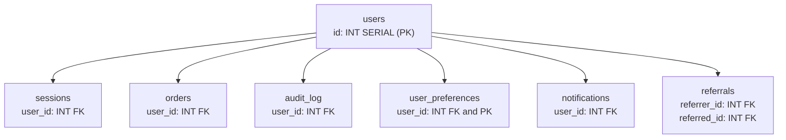

# ID Overflow Crisis

> Your `users` table primary key hits INT max in 14 weeks. The table has 1.8 billion rows, writes are running at 90,000 per hour, and there is no maintenance window. There has never been a maintenance window.

---

## Scenario

The platform has been running PostgreSQL 15 for four years. The `users` table was created with a standard `SERIAL` primary key — a 32-bit signed integer backed by a sequence, with a hard ceiling of 2,147,483,647. Nobody thought about it when the table was small.

It is not small anymore. The table sits at 1,832,000,000 rows. Writes have been accelerating: 40,000 per hour twelve months ago, 62,000 six months ago, 90,000 today. The team's projection model — accounting for continued acceleration rather than holding the rate flat — puts the sequence at overflow in approximately 14 weeks.

What happens at overflow: `nextval()` on `users_id_seq` throws `ERROR: nextval: reached maximum value of sequence "users_id_seq" (2147483647)`. PostgreSQL sequences are `NO CYCLE` by default — the sequence does not wrap. The INSERT never reaches the uniqueness check; it fails before any row is written. The application has no fallback for this error. It crashes and does not restart automatically.

A maintenance window was proposed at last week's incident review. The proposal lasted about four minutes. The platform serves enterprise customers globally across three timezones, all with contractual SLA guarantees. "Off-peak" does not exist. The DBA who raised it has not raised it again.

The `users` table is the central hub of the schema. Six tables reference `users.id` as a foreign key column, all typed as `INT`.



| Table            | Approximate Rows | Notes                                                                       |
| ---------------- | ---------------- | --------------------------------------------------------------------------- |
| users            | 1,832M           | The table being migrated                                                    |
| notifications    | ~4,300M          | Largest child table; notification fan-out from campaigns                    |
| user_preferences | ~1,832M          | 1:1 with users; user_id is both FK and PK                                   |
| audit_log        | ~2,100M          | audit_log.id is already BIGINT — migrated 18 months ago for the same reason |
| sessions         | ~500M            |                                                                             |
| orders           | ~180M            |                                                                             |
| referrals        | ~120M            | Two FK columns referencing users.id: referrer_id and referred_id            |

The sequence backing `users.id` is `users_id_seq`. Its current value is 1,832,000,000. Its declared type is `integer`.

---

## Your Task

Write your analysis in `my-analysis.md` before opening `rubric.md`.

1. Before proposing anything, write down the questions you would ask first. What do you need to know that is not already in this document? What assumptions in the current setup are you most uncertain about?
2. Identify the failure modes in a naive migration. What goes wrong if someone runs the obvious migration command?
3. Design the full migration plan. Name the specific sequence of operations, the order constraints must be handled in, and what "done" looks like before the old column can be dropped.
4. What risks remain after your migration, and why are they acceptable given the 14-week hard deadline?
5. Write your full reasoning in `my-analysis.md` before opening `rubric.md`.

---

## Prerequisites

If PostgreSQL lock modes and the `CONCURRENTLY` modifier are unfamiliar, read `tutorial.md` first. Otherwise, jump straight in.

---

## How to Self-Evaluate

Once you have written your analysis, open `rubric.md` and compare it against what you found.

To get AI-assisted feedback on your reasoning:

```bash
cd ../../ai-evaluator
node evaluate.js --exercise ../system-design/id-overflow-crisis
```
