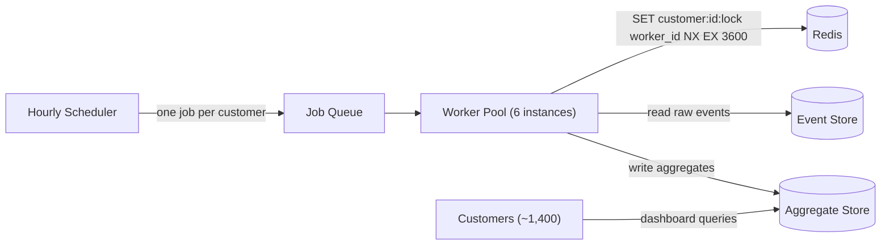

# Lock TTL Mismatch

> Seven customers in six weeks. All reporting the same thing — duplicate records in their hourly reports. All tickets closed without a confirmed fix.

---

## Scenario

The analytics platform runs per-customer data aggregation jobs on an hourly schedule. Each job reads a customer's raw event data, computes rollup statistics — daily active users, funnel conversion rates, session durations — holds the full result set in memory, and performs a single bulk INSERT into the aggregate store at the end of the run. Customers query that store to power the dashboards and reports they pay for.

To prevent two application instances from processing the same customer's job simultaneously, each job acquires a Redis distributed lock before processing begins. The team adopted the atomic form from the start:

`SET customer:{id}:lock {worker_id} NX EX 3600`

`NX` means the key is set only if it does not already exist. `EX 3600` sets a 60-minute expiry. This is the correct pattern — not the broken two-step `SETNX` + `EXPIRE` that introduces a race condition between the two commands. The team knows this. They checked.



Six weeks ago, the first support ticket arrived.

---

> **Ticket #4821 — Duplicate records in weekly active user report** *(opened 38 days ago)*
>
> Our weekly active user rollup for the period ending March 3 shows 14,200 unique users. When we cross-reference against our own raw event logs, we get 7,100. Every metric in that report is doubled. We've verified the raw event counts on our end are correct. Something upstream is writing every aggregate record twice.
>
> We're billing customers on downstream reports that derive from these aggregates. This is not a cosmetic issue.
>
> — Takahashi Analytics, Sr. Data Engineer

---

Six more tickets have followed, from six different customers, all describing the same pattern: aggregated metrics exactly doubled, sporadically, unreproducible on demand.

Engineering investigated twice. Both times, the findings were the same:

- The lock uses the correct atomic `SET NX EX` syntax — not the broken two-step form.
- The lock is released using a Lua script that verifies the worker ID before deleting the key, preventing a late-finishing job from accidentally releasing a lock it no longer holds.
- Redis is healthy: no connection errors, no evictions, no restarts in the lock store.
- Application logs show no errors during the affected time windows.
- No two worker processes were observed running the same customer's job simultaneously on any single host.

Both investigations closed without a confirmed root cause. The tickets keep coming.

Last week, a junior engineer watching the support queue filed an observation in the internal channel. It hasn't had a reply:

> *"The duplicate tickets seem to arrive in clusters, and those clusters line up with our busiest periods on the platform. Is that signal or just noise?"*

**System metrics:**

| Metric                | Value                   |
| --------------------- | ----------------------- |
| Job schedule          | Hourly, per customer    |
| Lock TTL              | 60 minutes              |
| Job duration — P50    | 12 minutes              |
| Job duration — P95    | 48 minutes              |
| Job duration — P99    | 72 minutes              |
| Active customers      | ~1,400                  |
| Application instances | 6 (horizontally scaled) |

---

## Your Task

Write your analysis in `my-analysis.md`. Cover:

1. **Before proposing anything, write down the questions you would ask first.** What do you need to know before you can diagnose the root cause? What do you need to know before you can design a fix?

2. **Diagnose the root cause.** What is actually causing the duplicate records? Trace the mechanism step by step — not just "two jobs overlap" but the specific sequence of events that produces doubled aggregate records. Use the metrics table to support your reasoning.

3. **Explain why both investigations failed to find the root cause.** What did they check? What did they correctly confirm? What did they fail to connect — and why does the answer live somewhere they didn't look?

4. **Propose fixes, in priority order.** For each fix, name what failure mode it specifically prevents. State what must be true about the aggregation job for your chosen approach to be correct. What would change your recommendation?

5. **After your changes, what risks remain?** Why are they acceptable given the constraints?

Write your full reasoning in `my-analysis.md` before opening `rubric.md`.

---

## Prerequisites

If Redis distributed locking — specifically the SETNX antipattern and why the atomic `SET NX EX` form fixes it — is new to you, read `tutorial.md` first. Otherwise, jump straight in.

---

## How to Self-Evaluate

Once you have written your analysis, open `rubric.md` and compare it against what you found.

To get AI-assisted feedback on your reasoning — especially useful for the uncertainties you flagged:

```bash
cd ../../ai-evaluator
node evaluate.js --exercise ../system-design/lock-mismatch
```
