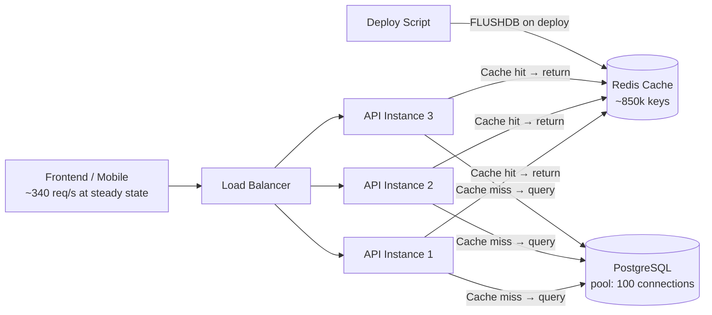

# Post-Deploy DB Saturation

> The post-mortem meeting is in 30 minutes. The slide deck says "root cause: deploy failure." You've been staring at the metrics for the last hour and something doesn't add up.

---

## Scenario

The catalog API serves product and inventory data to the e-commerce frontend. It has been in production for 22 months. The cache layer — Redis, cache-aside — holds approximately 850,000 keys at steady state. Cache hit rate runs at 93–95% under normal conditions, which keeps the PostgreSQL read load low and predictable.

Last Thursday at 14:22 UTC, a deploy went out. The release added a `last_updated_by` field to the cached product object to support a new front-end feature. Because a stale cached object missing this field would cause deserialization errors in the updated application code, the deploy script flushes Redis after pushing new code. This has been the deploy process for 22 months without incident.



The incident lasted approximately six minutes by the incident log. A post-mortem retrospective is underway. The current draft identifies root cause as "deploy failure" and proposes one action item: implement a rollback procedure capable of reverting a bad deploy within 90 seconds.

Here is the full evidence from the incident window.

**Timeline:**

- **14:22:00 UTC** — Deploy script executes `FLUSHDB` on Redis; all 850,000 cached keys evicted; new application code goes live
- **14:22:08 UTC** — PostgreSQL connection pool reaches ceiling (100/100 active); DB CPU at 94%
- **14:22:15 UTC** — API error rate climbs to 34%; p99 latency at 8.4 seconds
- **14:22:31 UTC** — p99 latency peaks at 28 seconds; request throughput drops as clients begin timing out and aborting
- **14:23:00 UTC** — On-call paged; incident declared
- **14:24:45 UTC** — Cache hit rate recovers to 72%; error rate drops to 3.8%
- **14:28:30 UTC** — Error rate falls below 0.5%; p99 returns to 95ms; on-call declares incident resolved; deploy marked successful in release log
- **14:32:00 UTC** — Post-mortem retrospective begins; discussion centers on whether rollback should have been initiated at 14:23:00 rather than riding it out
- **14:36:00 UTC** — PostgreSQL CPU returns to 8% baseline; cache hit rate returns to 94%

**Metrics:**

| Time (UTC) | Req/s | Cache Hit Rate | DB Connections | DB CPU | Error Rate | p99 Latency |
| ---------- | ----- | -------------- | -------------- | ------ | ---------- | ----------- |
| 14:21:50   | 340   | 94%            | 12 / 100       | 8%     | 0.1%       | 85ms        |
| 14:22:08   | 342   | 0%             | 100 / 100      | 94%    | 0.8%       | 290ms       |
| 14:22:15   | 338   | 0%             | 100 / 100      | 100%   | 34.2%      | 8,400ms     |
| 14:22:31   | 187   | 0%             | 100 / 100      | 100%   | 41.7%      | 28,000ms    |
| 14:24:45   | 341   | 72%            | 18 / 100       | 61%    | 3.8%       | 340ms       |
| 14:28:30   | 343   | 72%            | 31 / 100       | 61%    | 0.4%       | 95ms        |
| 14:36:00   | 340   | 94%            | 11 / 100       | 8%     | 0.1%       | 88ms        |

---

## Your Task

Write your analysis in `my-analysis.md`. Cover:

1. **Before proposing anything, write down the questions you would ask first.** What does the evidence not yet answer? What assumptions in the current architecture are you most uncertain about? Are there data points in the metrics table that do not fit the current root cause hypothesis — and if so, what would need to be true for them to fit?

2. **Diagnose the actual failure mode.** The post-mortem draft attributes this to "deploy failure." Work through the 14:22:08 row specifically — request rate, cache hit rate, and DB connections together. What specific phenomenon does that combination prove is happening to the database? What does it rule out?

3. **Evaluate the trigger and the design weakness.** First, was the `FLUSHDB` command actually necessary for the specific schema change described in the scenario? Second, what structural property of the cache layer made this outcome inevitable given a full cache flush? Would the same failure mode occur under other conditions even if `FLUSHDB` was removed from the deploy script? Be specific about what those other conditions are.

4. **Evaluate the proposed action item.** The retrospective's current recommendation is a 90-second rollback procedure. Would that have prevented this incident? Trace what a rollback at 14:23:00 would actually have done, step by step.

5. **Analyze the recovery.** The on-call engineer declared the incident resolved at 14:28:30. Look closely at the metrics at that exact timestamp. Was the system actually recovered? What monitoring gap allowed the team to declare success while the database was still under abnormal stress?
   
6. **Propose what should change and what risks remain.** What changes to the caching architecture and deploy process prevent this? For each change, name what failure mode it prevents — specifically, not in general terms. After your changes, what failure modes remain and why are they acceptable?

Write your full reasoning in `my-analysis.md` before opening `rubric.md`.

---

## Prerequisites

If the cache-aside pattern and concurrent cache rebuild mechanics are unfamiliar, read `tutorial.md` first. Otherwise, jump straight in.

---

## How to Self-Evaluate

Once you have written your analysis, open `rubric.md` and compare it against what you found.

To get AI-assisted feedback on your reasoning — especially useful for the uncertainties you flagged:

```bash
cd ../../ai-evaluator
node evaluate.js --exercise ../system-design/post-deploy-db-saturation
```
