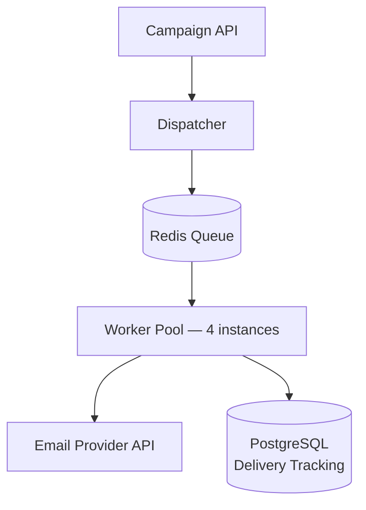

# Queue Disaster

> The 500k test campaign ended two hours ago. 8,400 duplicate emails are confirmed. The 4 million campaign launches in 72 hours.

---

## Scenario

The notification service has been in production for eight months. It handles 50,000 messages per day without incident — transactional emails, password resets, weekly digests. Last week, Marketing confirmed a campaign targeting 4 million users launching this Friday. Engineering ran a 500k user test campaign overnight to validate capacity before the real thing. Here is what happened.

**Current architecture:**



Workers dequeue messages from Redis in batches of 500 using RPOPLPUSH — each batch moves atomically from the main queue into a separate in-flight set. A recovery job runs every 60 seconds and re-enqueues any messages that have been in the in-flight set for more than 90 seconds without acknowledgment. Workers do not pass a deduplication parameter to the email provider API.

**Timeline — 500k test campaign:**

- **03:00 UTC** — Campaign dispatched; dispatcher begins enqueuing 500k messages
- **03:08 UTC** — Dispatcher completes; all messages in queue; 4 workers consuming at ~190 msg/s; queue depth: 412,000
- **03:31 UTC** — Queue depth: 248,000; worker CPU averaging 74%; worker heap climbing steadily
- **03:47 UTC** — Email provider begins returning 429s; workers enter retry backoff loops; p99 spikes
- **03:52 UTC** — Worker-2 OOM crash (heap at 1.4GB); recovery job re-enqueues its 500-message in-flight batch; Worker-2 restarts and begins reprocessing from the start of its batch
- **04:01 UTC** — Three more workers OOM crash in cascade; queue consumption halts
- **04:09 UTC** — On-call manually scales to 16 workers; consumption resumes
- **04:31 UTC** — Campaign delivery completes
- **04:45 UTC** — 8,400 duplicate emails confirmed across 6,100 users
- **05:30 UTC** — Email provider account team flags: the 500k test consumed 25% of the account's monthly send quota

**Metrics — 500k test campaign:**

| Time (UTC) | Queue Depth | Active Workers | Error Rate | p99 Latency | Worker Avg Heap |
| ---------- | ----------- | -------------- | ---------- | ----------- | --------------- |
| 03:08      | 412,000     | 4              | 0.0%       | 95ms        | 285MB           |
| 03:31      | 248,000     | 4              | 0.3%       | 340ms       | 520MB           |
| 03:47      | 198,000     | 4              | 5.1%       | 4,800ms     | 890MB           |
| 03:52      | 198,000     | 3→4            | 22.4%      | 14,200ms    | 1,400MB         |
| 04:09      | 187,000     | 16             | 6.8%       | 2,100ms     | 310MB           |
| 04:31      | 0           | 16             | 0.3%       | 115ms       | 175MB           |

---

## Your Task

Write your analysis in `my-analysis.md`. Cover:

1. Before proposing anything, write down the questions you would ask first. What do you need to know before you can design anything? Pay particular attention to the 05:30 UTC entry in the timeline — what does it tell you, and what would you need to find out before Friday?
2. What structural problem in the current architecture caused the 8,400 duplicates? Trace the mechanism specifically — not just "workers crashed," but what the crash state means for the messages already pulled from the queue.
3. What caused the OOM cascade at 04:01 UTC? Connect it to the events at 03:47. Why did scaling to 16 workers at 04:09 appear to fix it when it didn't change the underlying conditions?
4. What changes would you propose before the 4M campaign, in priority order? For each one, name what it prevents — not just what it improves. Include any changes that must happen before Friday regardless of what else you build.
5. After your changes, what risks remain? Why are those risks acceptable given the constraints?

Write your full reasoning in `my-analysis.md` before opening `rubric.md`.

---

## Prerequisites

If idempotency in distributed messaging is new to you, read `tutorial.md` first. Otherwise, jump straight in.

---

## How to Self-Evaluate

Once you have written your analysis, open `rubric.md` and compare it against what you found.

To get AI-assisted feedback on your reasoning — especially useful for the uncertainties you flagged:

```bash
cd ../../ai-evaluator
node evaluate.js --exercise ../system-design/queue-disaster
```
