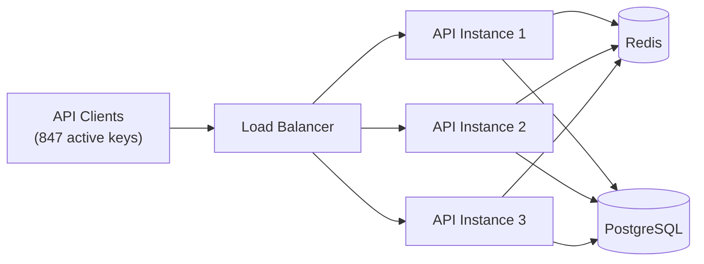

# Rate Limit Semantics Shift

> Your manager replied to the Meridian thread 20 minutes ago: "Sliding window is the right call. Let's do it properly." The message has seven thumbs-up reactions. It's your problem now.

---

## Scenario

The payments API has been in production for 14 months. It serves 847 active API keys across customers ranging from early-stage startups to large enterprise accounts. The API enforces a single rate limit: 1,000 requests per minute per API key, implemented as fixed-window in Redis.

Current implementation:

- **Key schema:** `ratelimit:{api_key}:{epoch_minute}`
- **On each request:** `INCR key`, reject if the result exceeds 1,000, `EXPIRE key 60` on the first write of each window
- **Cleanup:** none required — keys expire naturally after 60 seconds

The system runs across three API instances behind a load balancer, all reading and writing to the same Redis instance for rate limit state. It handles 2.4 million rate limit checks per day. Peak load is approximately 4,200 checks per minute across all keys.



Three weeks ago, Meridian Financial — your largest enterprise customer — opened a support ticket:

---

> **Subject: RE: API Rate Limiting — Reconciliation Pipeline Errors [Ticket #API-2847]**
>
> We've been experiencing 429 errors on our payment reconciliation pipeline since go-live and haven't been able to build a reliable workaround.
>
> Our setup: we run up to six reconciliation jobs in parallel. Each job makes 150–250 API calls over a 20–30 second window. In isolation, each job is well within the 1,000 requests per minute limit. The errors appear when multiple jobs overlap and their combined call volume approaches the limit near a minute boundary — specifically when a burst from one window leaves insufficient quota at the start of the next window.
>
> We've tried staggering job start times, but the overlap still occurs under load. We need a more predictable enforcement model. The current behavior is causing 4–6 minute delays in our settlement reporting, which is time-sensitive.
>
> — James Whitfield, Sr. Platform Engineer, Meridian Financial

---

The account manager escalated. Your manager read the ticket, replied to the thread, and the plan is now set: migrate the rate limiter to sliding window semantics.

You have been assigned to design and deliver the implementation.

---

## Your Task

Write your analysis in `my-analysis.md`. Cover:

1. **Before proposing anything, write down the questions you would ask first.** What do you need to know before committing to any implementation? What would change your answer? If sliding window is the right fix, what confirms that? If it isn't, what does a better solution look like — and how do you make that case after the manager has already committed publicly?

2. **Analyze the behavioral contract change.** Which existing API customers might be affected by switching from fixed-window to sliding-window semantics, and how would you identify them before shipping? What does "affected" actually mean here — and is the effect always negative?

3. **Design the migration path.** What does moving from the current Redis schema to a sliding-window schema look like under live traffic, across three API instances, with no downtime? Walk through the schema change, the rollout strategy, and how you maintain consistent enforcement during the transition.

4. **Evaluate the implementation options and remaining risks.** If you implement sliding window, which approach — log or counter — is appropriate here and why? What risks remain after your chosen approach, and why are they acceptable given the constraints?

5. Write your full reasoning in `my-analysis.md` before opening `rubric.md`.

---

## Prerequisites

If sliding window log and sliding window counter are new to you — or if you've heard of them but haven't worked through the Redis implementations or the counter approximation formula — read `tutorial.md` first. Otherwise, jump straight in.

---

## How to Self-Evaluate

Once you have written your analysis, open `rubric.md` and compare it against what you found.

To get AI-assisted feedback on your reasoning — especially useful for the uncertainties you flagged:

```bash
cd ../../ai-evaluator
node evaluate.js --exercise ../system-design/rate-limit-semantics-shift
```
